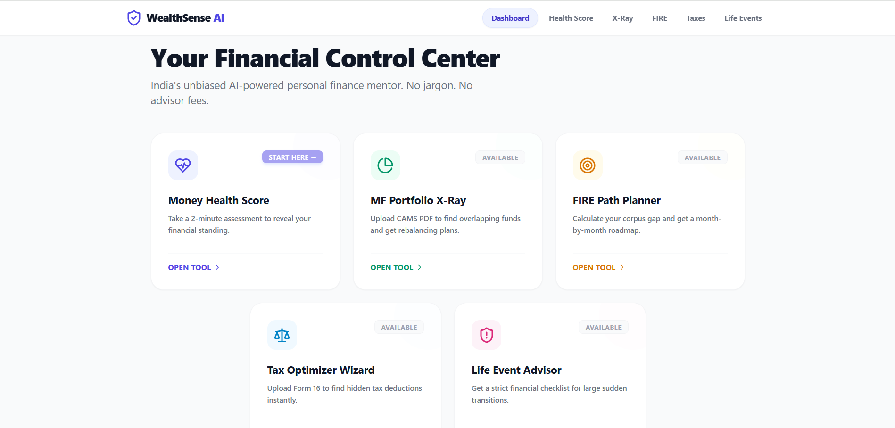
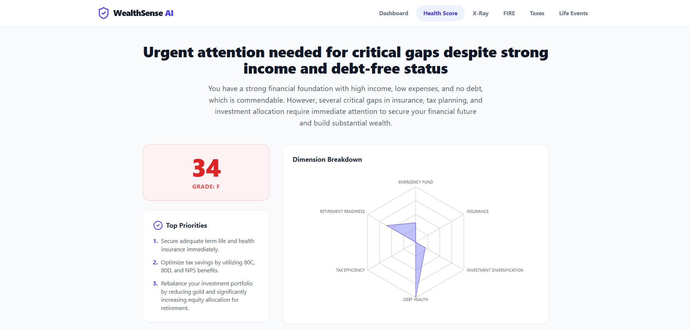
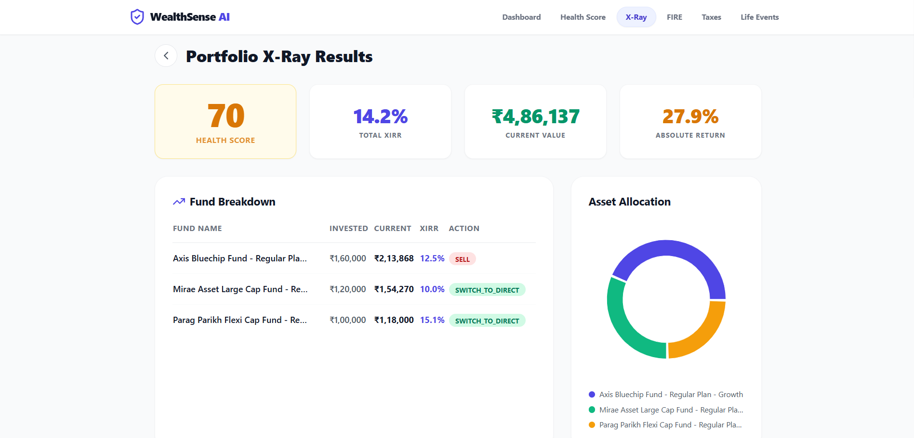
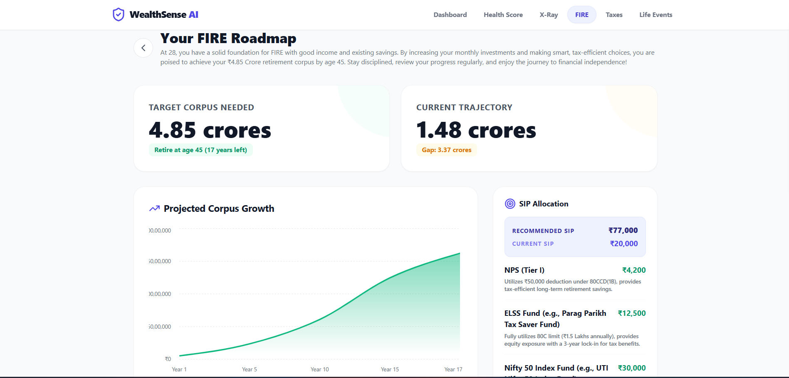
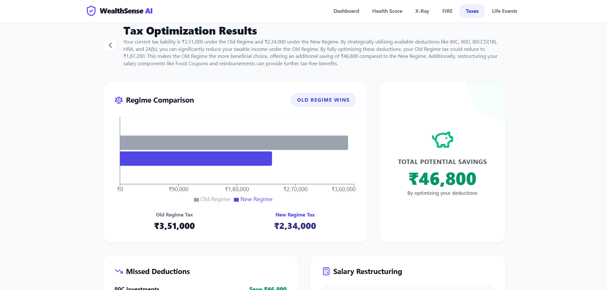
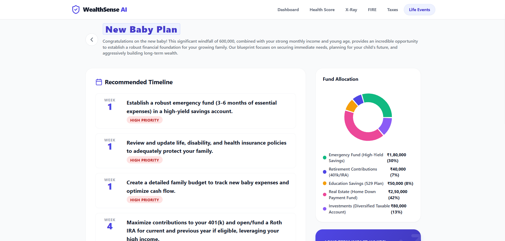

# WealthSense AI 💰

> India's AI-powered personal finance mentor. No jargon. No advisor fees. No waiting.



**ET AI Hackathon 2026 — Problem Statement 9: AI Money Mentor**

---

## The Problem

- **95% of Indians** have no financial plan
- A human financial advisor costs **₹25,000+/year** and serves only the top 2%
- 14 crore+ demat account holders are investing on gut feel, missing deductions, and flying blind on retirement
- Analysing a CAMS mutual fund statement manually takes **2–3 hours**. WealthSense AI does it in **10 seconds**

---

## What WealthSense AI Does

WealthSense AI is a full-stack web application with 5 AI-powered financial tools — all connected through a unified dashboard. It replaces a ₹25,000/year financial advisor for anyone with a phone and an internet connection.

### 5 Tools in One App

| Tool | What it does | Time saved |
|---|---|---|
| 💚 **Money Health Score** | 15-question assessment → score across 6 financial dimensions with a radar chart and action plan | Instant vs never |
| 📊 **MF Portfolio X-Ray** | Upload CAMS PDF → true XIRR, fund overlap %, expense drag, AI rebalancing plan | 10 sec vs 2–3 hrs |
| 🎯 **FIRE Path Planner** | Input your profile → month-by-month SIP roadmap to retirement with corpus gap analysis | Instant vs ₹25K/year |
| 🧾 **Tax Optimizer Wizard** | Upload Form 16 → every missed deduction found, old vs new regime compared with your exact numbers | Instant vs CA fees |
| 🔔 **Life Event Advisor** | Bonus, inheritance, marriage, new baby → specific INR-level action plan for your situation | Instant vs guessing |

### The Connected Experience
Every tool shares your profile. Take the Health Score once — your age, income, and risk appetite pre-fill every other tool automatically. It's one financial journey, not 5 disconnected calculators.

---

## Demo

### Live Demo Flow (3 minutes)
1. **Health Score** — Enter profile → get score 58/100, critical gap in insurance and retirement flagged
2. **Portfolio X-Ray** — Upload CAMS PDF → XIRR 14.2%, overlap 68% between large cap funds detected, rebalancing plan generated
3. **FIRE Planner** — Pre-filled from Health Score → ₹2.2 crore corpus gap identified, ₹27,000/month SIP increase needed
4. **Tax Wizard** — Enter salary → ₹42,000 in missed deductions found across 80D, NPS, HRA
5. **Life Event** — "I got a ₹5L bonus" → week-by-week action plan with exact fund allocations

### Screenshots

| Dashboard | Money Health Score |
|---|---|
|  |  |

| Portfolio X-Ray | FIRE Planner |
|---|---|
|  |  |

| Tax Wizard | Life Event Advisor |
|---|---|
|  |  |

---

## Tech Stack

| Layer | Technology | Purpose |
|---|---|---|
| Frontend | React 18 + Vite | Fast, component-driven UI |
| Styling | TailwindCSS v3 | Utility-first styling |
| Charts | Recharts | Portfolio and FIRE visualizations |
| Backend | Python FastAPI | Async REST API |
| PDF Parsing | PyMuPDF (fitz) | CAMS and Form 16 extraction |
| Financial Math | numpy + scipy | XIRR, SIP calculations |
| AI Engine | Claude API (claude-sonnet-4-20250514) | Financial reasoning + JSON output |
| HTTP Client | Axios | Frontend ↔ Backend |

---

## Project Structure

```
wealthsense-ai/
├── backend/
│   ├── main.py                  # FastAPI app + all routes
│   ├── services/
│   │   ├── claude_service.py    # All Claude API calls + prompts
│   │   ├── pdf_parser.py        # PyMuPDF CAMS + Form 16 parsing
│   │   └── financial_calc.py    # XIRR, SIP, overlap calculations
│   ├── models/
│   │   └── schemas.py           # Pydantic request/response models
│   ├── requirements.txt
│   └── .env                     # Your API key (never commit this)
│
├── frontend/
│   ├── src/
│   │   ├── App.jsx              # Router + layout
│   │   ├── pages/
│   │   │   ├── Dashboard.jsx
│   │   │   ├── HealthScore.jsx
│   │   │   ├── PortfolioXray.jsx
│   │   │   ├── FirePlanner.jsx
│   │   │   ├── TaxWizard.jsx
│   │   │   └── LifeEvent.jsx
│   │   ├── components/
│   │   │   ├── Navbar.jsx
│   │   │   ├── FileUpload.jsx
│   │   │   ├── LoadingAI.jsx
│   │   │   └── InsightCard.jsx
│   │   ├── context/
│   │   │   └── UserContext.jsx  # Global profile state across tools
│   │   └── utils/
│   │       └── formatters.js    # INR formatting utilities
│   └── package.json
│
└── README.md
```

---

## Setup & Installation

### Prerequisites
- Python 3.10+
- Node.js 18+
- An [Anthropic API key](https://console.anthropic.com/)

---

### Step 1 — Clone the repo

```bash
git clone https://github.com/YOUR_USERNAME/wealthsense-ai.git
cd wealthsense-ai
```

---

### Step 2 — Backend setup

```bash
cd backend

# Create and activate virtual environment
python -m venv .venv
source .venv/bin/activate        # Mac/Linux
# .venv\Scripts\activate         # Windows

# Install dependencies
pip install -r requirements.txt

# Create your .env file
cp .env.example .env
# Now open .env and add your Anthropic API key
```

Edit `.env`:
```
ANTHROPIC_API_KEY=sk-ant-your-key-here
```

Start the backend:
```bash
uvicorn main:app --reload
# Running at http://localhost:8000
```

Verify it works:
```bash
curl http://localhost:8000/api/health
# {"status":"ok"}
```

---

### Step 3 — Frontend setup

```bash
# Open a new terminal tab
cd frontend

npm install

npm run dev
# Running at http://localhost:5173
```

---

### Step 4 — Open the app

Visit [http://localhost:5173](http://localhost:5173)

Start with **Money Health Score** — it takes 2 minutes and pre-fills all other tools.

---

## Environment Variables

Copy `.env.example` to `.env` in the `/backend` folder:

```bash
# backend/.env.example

ANTHROPIC_API_KEY=your_anthropic_api_key_here
```

> Never commit your `.env` file. It is listed in `.gitignore`.

---

## API Endpoints

| Method | Endpoint | Input | Output |
|---|---|---|---|
| GET | `/api/health` | — | `{"status": "ok"}` |
| POST | `/api/health-score` | JSON: 15 financial answers | Score, 6 dimensions, recommendations |
| POST | `/api/portfolio-xray` | Multipart: CAMS PDF | XIRR, overlap %, rebalancing plan |
| POST | `/api/fire-plan` | JSON: financial profile | Month-by-month SIP roadmap |
| POST | `/api/tax-wizard` | Multipart: Form 16 PDF or JSON salary | Missed deductions, regime comparison |
| POST | `/api/life-event` | JSON: event type + amounts | Prioritized action plan |

---

## How the AI Works

Every tool follows the same pattern:

```
User Input
    ↓
FastAPI Backend
    ↓
PDF parsed with PyMuPDF (if file upload)
Financial calculations with numpy/scipy (XIRR, SIP math)
    ↓
Structured data sent to Claude API
(claude-sonnet-4-20250514)
    ↓
Claude returns JSON with analysis + recommendations
    ↓
React renders charts, tables, and insight cards
```

Claude is prompted to respond in **structured JSON only** — no prose, no markdown. This makes the output 100% predictable and renderable as charts. All financial reasoning (deduction identification, FIRE corpus math, rebalancing logic) happens inside Claude using India-specific context: ELSS, NPS, PPF, 80C/80D limits, old vs new tax regime, INR amounts throughout.

### Error Handling
- PDF unreadable → fallback to manual input form
- Claude API timeout → auto-retry with cached fallback
- Partial data → partial analysis with confidence indicator, never a blank page

---

## Impact Model

| Metric | Number |
|---|---|
| Demat accounts in India | 14 crore+ (SEBI 2024) |
| Indians without a financial plan | 95% (NCFE survey) |
| Annual advisor cost (HNI) | ₹25,000+/year |
| Average missed tax deductions found | ₹40,000–₹80,000/user |
| CAMS analysis time: manual vs AI | 2–3 hours vs ~10 seconds |
| If 1% of demat holders use WealthSense AI | 14 lakh users |
| Collective advisor fees saved | ₹3,500 crore/year |
| Tax savings unlocked (₹40K avg × 14L users) | ₹5,600 crore/year |

> "We are democratizing financial advice that today costs ₹25,000/year and reaches only 2% of Indians. WealthSense AI makes it free, instant, and available to anyone with a phone."

---

## Submission Details

- **Hackathon:** ET AI Hackathon 2026
- **Problem Statement:** PS9 — AI Money Mentor
- **Team size:** Solo
- **Built with:** React + FastAPI + Claude API

### Submission Checklist
- [x] Public GitHub repository with commit history
- [x] Working demo (all 5 tools functional)
- [x] README with setup instructions
- [ ] 3-minute pitch video
- [ ] Architecture document (1–2 pages)
- [ ] Impact model

---

## Local Development Tips

**Run both servers at once (Mac/Linux):**
```bash
# Terminal 1
cd backend && source .venv/bin/activate && uvicorn main:app --reload

# Terminal 2
cd frontend && npm run dev
```

**Test the API directly:**
```bash
# Health Score
curl -X POST http://localhost:8000/api/health-score \
  -H "Content-Type: application/json" \
  -d '{"age": 28, "monthly_income": 120000, "monthly_expenses": 60000, "emergency_fund_months": 2, "has_term_insurance": false, "has_health_insurance": true, "monthly_sip": 15000, "equity_pct": 80, "debt_pct": 20, "gold_pct": 0, "has_home_loan": false, "invests_in_80c": true, "invests_in_nps": false, "has_health_insurance_80d": false}'
```

**CAMS demo data** (use this if you don't have a real statement):
The app includes a "Use demo data" button on the Portfolio X-Ray page that loads a pre-built 5-fund portfolio for testing.

---

## License

MIT License — built for ET AI Hackathon 2026.

---

<div align="center">
  <strong>Built for the 95% of Indians flying blind on their finances.</strong><br/>
  <em>ET AI Hackathon 2026 | PS9: AI Money Mentor</em>
</div>
